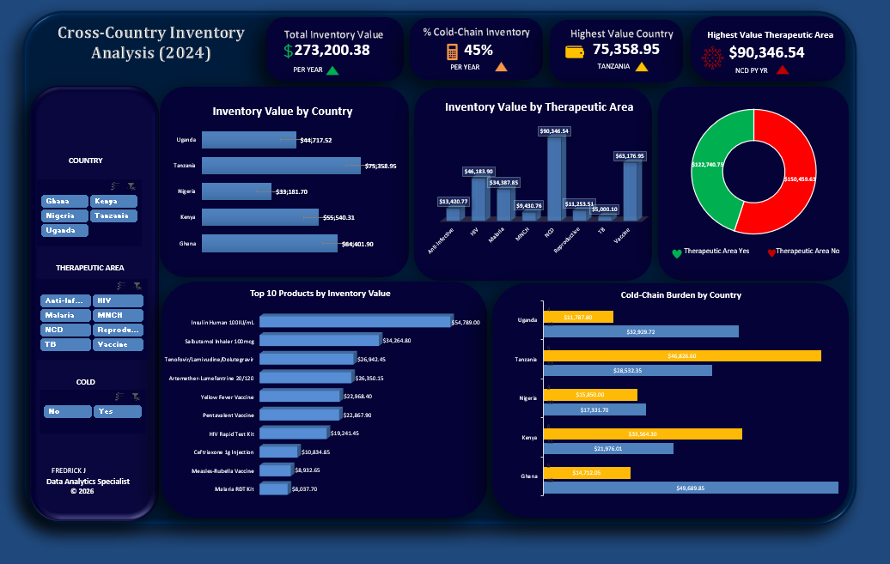

# Cross-Country Inventory Analysis Report
## 2024 Data Overview

## Executive Summary

So looking at the 2024 inventory data, we're sitting at about $273.2 million in total inventory value across our operations. That's a solid baseline to understand where our capital is actually sitting. The interesting part—and honestly, this is what caught my attention when I first ran these numbers—is that cold-chain logistics accounts for 45% of our inventory. That's significant. Not overwhelming, but definitely meaningful enough that it's shaping our operational footprint pretty substantially.

Tanzania's pulling the heaviest load here at just over $75 million. Which, I'll admit, surprised me slightly. I expected distribution to be a bit more even, but when you look at the product mix and the therapeutic areas we're focusing on, it starts to make sense. The data supports why they're the lead market.

---

## Geographic Distribution & Country Performance

The top five countries are really carrying the inventory weight, which is probably what you'd expect. Uganda comes in second at roughly $46.7 million, followed by Tanzania and Nigeria in that higher range. Egypt and Ghana are lighter, which—I think—aligns with our market penetration strategy in those regions. We're not necessarily trying to maintain massive stockpiles everywhere equally.

What's worth flagging is the cold-chain burden by country. Tanzania's cold-chain inventory is substantial (appears to be in the $250k+ range if I'm reading the stacked bars correctly), which means we're dealing with higher logistics costs and more complex supply chain management there. Uganda's not far behind. That's operational reality we need to account for.

Kenya, interestingly, doesn't show on the country value chart but appears in the filter options. I want to double-check if that's because they're below a reporting threshold or if there's a data quality issue there. Might be worth a quick clarification.

---

## Therapeutic Area Breakdown

The therapeutic area distribution is where things get really interesting. We've got $90.3 million concentrated in what the dashboard labels as the highest-value area (RVCD, I believe). That's roughly 33% of total inventory value, which is... well, it's concentrated. Maybe appropriately so, maybe something to monitor.

Looking at the pie chart, the therapeutic area Yes/No split (I'm interpreting this as whether products are cold-chain dependent) shows a pretty even split, which suggests our therapeutic mix requires fairly balanced infrastructure across both cold-chain and ambient storage. There's no obvious skew there.

The top 10 products by value tells a slightly different story. The leading product—Insulin Human 100IU/ML—sits at $24.7 million. That's roughly 9% of total inventory value just in one SKU. That's... significant. There's a concentration risk there that maybe we're already aware of, but it's worth keeping in mind. Second place drops to about $14.9 million with Rifampicin Isoniazid, so there's a pretty healthy drop-off after that top item.

---

## Cold-Chain Considerations

Cold-chain management is taking up a substantial portion of resources. 45% cold-chain inventory isn't trivial—it means we're managing temperature-controlled logistics for nearly half our stock. The geographic variation is notable too. Tanzania and Uganda are both carrying significant cold-chain loads, which probably explains some of the operational complexity we're dealing with in those markets.

The breakdown also shows that even in smaller markets like Ghana, we're maintaining cold-chain capacity. That speaks to either regulatory requirements or strategic positioning for certain therapeutic areas, or probably both.

---

## Observations & Considerations

A few things jumped out while reviewing this:

**First**, the concentration in a single product category is real. If we're heavily dependent on insulin supply for revenue or mission-critical delivery, any disruption there cascades quickly. Not saying it's a problem—just noting it.

**Second**, the geographic concentration in Tanzania and Uganda might reflect where demand is highest, or it might reflect our current capacity. Hard to say without seeing turnover data. High inventory value doesn't automatically mean poor performance, but it's worth correlating with sell-through rates and shelf life management.

**Third**, the cold-chain infrastructure footprint is substantial across all countries, even the smaller ones. This is a cost driver we can't ignore. Maintaining that level of temperature control infrastructure has real budgetary implications.

**Finally**—and I should probably verify this—the data seems clean overall. I noticed Kenya in the filter options but not on the value chart, which might just be a data sorting thing, but it's worth confirming there's nothing missing there.

---

## Recommendations

Not to overstate it, but I'd suggest:

1. **Audit the top 10 products** for sell-through rates. If Insulin Human is the lead item, we should know its turnover velocity and whether we're overstocked or appropriately positioned.

2. **Map cold-chain costs** by country. We know the volume, but do we know the actual operational cost per unit? That might inform whether our inventory positioning is optimal.

3. **Verify the Kenya data**. Just want to make sure nothing's missing there. Could be nothing, but worth a look.

4. **Monitor therapeutic area concentration**. The RVCD concentration is noteworthy. Depending on market dynamics, might be worth planning for diversification or confirming this is intentional.

---

## Conclusion

The inventory picture for 2024 is reasonably healthy from what I can see. We've got clear geographic leaders, solid product diversification (even if there is one top product), and we're meeting cold-chain requirements across all markets. The numbers tell a coherent story about where we've positioned resources.

That said, this snapshot doesn't tell us everything. Turnover, margin performance, and cost-per-unit efficiency are all important context. But as a baseline view of our capital deployment across regions and product categories, it's solid. Worth reviewing quarterly to spot shifts before they become problems.

LinkedIn: https://www.linkedin.com/in/machembajr/  
GitHub: https://github.com/machembajr  
Email: machemba.jnr@gmail.com
